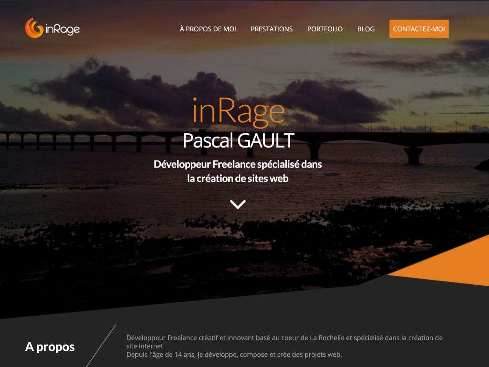

# inRage: A React / NextJS portfolio of a French Web developer

[](https://github.com/inrage/inrage/commits/main)


Initially developed under WordPress, I decided to refactor the whole project under React with the support of Next JS.

To retrieve projects (portfolio) and blog posts, I use the WordPress API with [GraphQL](https://fr.wordpress.org/plugins/wp-graphql/).

Since the project part has ACF custom fields. I use a second [GraphQL extension](https://www.wpgraphql.com/acf/) to manage them



## Installation

Make sure to use newest version of Node JS (v16).

```bash
yarn
yarn dev
```

You can now access to the project with : http://localhost:3000

## Configuration 

In order to run correctly this project, you must define some environment variables.

- `AKISMET_API_KEY`: Your Akismet API Key to check spam
- `MJ_APIKEY_PUBLIC`: Your API Mailjet username 
- `MJ_APIKEY_PRIVATE`: Your API Mailjet password
- `WORDPRESS_API_URL`: https://YOUR-WEBSITE/graphql 
