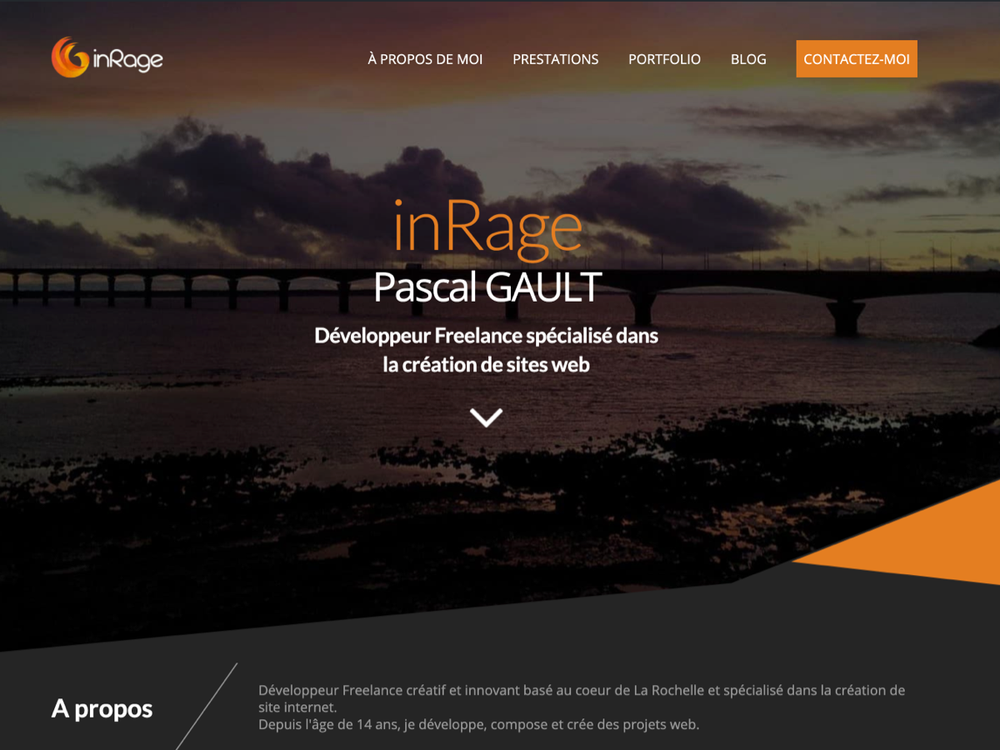

# inRage: A React / NextJS portfolio of a French Web developer

[](https://github.com/akiletour/inrage/commits/main)

[](https://github.com/Akiletour)

<p align="center">

</p>

Initially developed with WordPress, I decided to refactor the whole project with Next.js.

All projects (portfolio) and blog posts are written in MDX and live in `app/content/`.



## 📦 Stack

### Core Technologies

- `TypeScript`: v5.9+
- `Next.js`: v16.0 (App Router)
- `React`: v19.2
- `Node.js`: v24+ (Volta)
- `pnpm`: v10.3 (Package manager)

### Styling & Animations

- `Tailwind CSS`: v4.1+ with Typography plugin
- `Framer Motion`: v12+ for page transitions and animations
- `GSAP`: v3+ for advanced animations

### Content & Forms

- `MDX`: Blog posts and portfolio projects with frontmatter support
- `React Hook Form`: Form management
- `Akismet`: Spam protection for contact form
- `Mailjet`: Email service integration

### DevOps & Monitoring

- `Sentry`: Error tracking and performance monitoring
- `Turbopack`: Build tool (dev & production)
- `Jest`: Testing framework
- `ESLint`: Next.js core + TypeScript + Prettier

## ⚡️ Installation

Make sure to use a recent version of Node.js (>= v24).

```bash
pnpm install
pnpm dev
```

You can now access to the project with: http://localhost:3000

### Available Commands

- `pnpm dev` - Start development server with Turbopack (http://localhost:3000)
- `pnpm build` - Build production application with Turbopack
- `pnpm start` - Start production server
- `pnpm lint` - Run ESLint for code quality
- `pnpm type-check` - TypeScript type checking
- `pnpm test` - Run Jest tests in watch mode

## 🔧 Configuration

To correctly run this project, you must create an environment variable named `.env.local`.

- `AKISMET_API_KEY`: Your Akismet API Key to check spam
- `MJ_APIKEY_PUBLIC`: Your API Mailjet username
- `MJ_APIKEY_PRIVATE`: Your API Mailjet password
- `SLACK_WEBHOOK_URL`: If set, on each contact message, a Slack Webhook will be sent.

## 🏗️ Architecture

### Project Structure

```
app/
├── (pages)/          # Route groups for main pages
├── components/       # Reusable React components
├── types/            # TypeScript type definitions
├── libs/             # Utility libraries and API functions
├── utils/            # Helper utilities
├── hooks/            # Custom React hooks
├── layouts/          # Layout components
```

### Path Aliases

The project uses TypeScript path aliases for cleaner imports:

- `@/*` → `app/*`
- `@component/*` → `app/components/*`
- `@layout/*` → `app/layouts/*`
- `@hook/*` → `app/hooks/*`
- `@type/*` → `app/types/*`
- `@lib/*` → `app/libs/*`
- `@util/*` → `app/utils/*`
- `@image/*` → `public/images/*`

### Key Features

- **App Router**: Using Next.js 16 App Router architecture
- **TypeScript Strict Mode**: Comprehensive type safety
- **MDX Support**: Blog posts and portfolio projects written in MDX with frontmatter
- **Tailwind Custom Theme**: 8px increment spacing system with custom color palette
